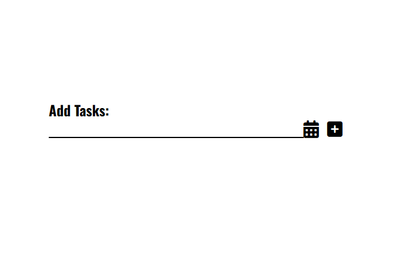
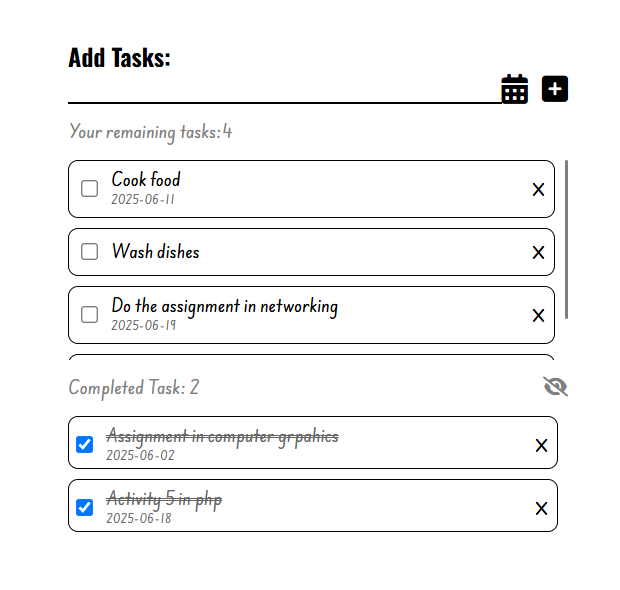

📝 Task Management Application
A modern, responsive task management web application built with vanilla JavaScript, HTML, and CSS. This application helps users organize their daily tasks with an intuitive interface and smooth animations.
🌟 Features
✅ Task Management

Add Tasks - Create new tasks with custom names
Set Due Dates - Assign deadlines using an integrated calendar picker
Complete Tasks - Mark tasks as done with checkbox interaction
Delete Tasks - Remove unwanted tasks from your list
Task Counter - Real-time count of remaining active tasks

📅 Calendar Integration

Date Picker - Easy-to-use calendar interface for setting due dates
Auto-close Calendar - Calendar automatically closes after task creation
Due Date Display - Clear date formatting for each task

✨ Completed Tasks Management

Toggle Visibility - Show/hide completed tasks with eye icon
Completed Counter - Track number of finished tasks
Restore Tasks - Move completed tasks back to active list
Visual Distinction - Strikethrough styling for completed items

🎨 User Experience

Smooth Animations - Fade-in slide animations for new tasks
Responsive Design - Works seamlessly on desktop and mobile
Scrollable Lists - Handle large numbers of tasks efficiently
Input Validation - Prevents empty task submission with user feedback
Auto-clearing Inputs - Form fields reset after successful submission

🚀 Technologies Used

HTML5 - Semantic markup structure
CSS3 - Modern styling with animations and transitions
Vanilla JavaScript - Pure JS for all functionality
Font Awesome - Professional icons throughout the interface
Google Fonts - Beautiful typography (Inter, Edu SA Hand, Oswald)

📱 Screenshots

Clean, modern interface with intuitive task management
🛠️ Installation & Usage
Quick Start

Clone this repository:
bashgit clone https://github.com/yourusername/task-management-app.git

Navigate to the project directory:
bashcd task-management-app

Open index.html in your web browser or use a local server:
bash# Using Python
python -m http.server 8000

# Using Node.js
npx serve .

Start managing your tasks! 🎉

File Structure
task-management-app/
│
├── index.html          # Main HTML file
├── style.css           # Stylesheet with modern design
├── script.js           # JavaScript functionality
└── README.md           # This file
💡 How to Use

Adding Tasks

Type your task in the input field
Click the calendar icon to set a due date (optional)
Click the plus icon to add the task

Managing Tasks

Check the checkbox to mark tasks as complete
Click the X button to delete tasks
Use the eye icon to show/hide completed tasks

Task Organization

Completed tasks are hidden by default but can be toggled
Completed tasks can be restored to active status

🎯 Key Features Breakdown
Form Validation

Empty input validation with user-friendly popup messages
Auto-dismissing notifications (2-second timeout)
Prevents submission of whitespace-only tasks

Animation System

Smooth fade-in animations for new tasks
Transition effects for showing/hiding completed tasks
Professional micro-interactions throughout

Data Management

Efficient array-based task storage
Real-time UI updates
Proper state management for completed/active tasks

Responsive Design

Mobile-first approach
Flexible layouts that adapt to screen size
Touch-friendly interface elements

🌐 Live Demo
[View Live Demo](https://frehitz-todolist.netlify.app/)
🤝 Contributing
Contributions are welcome! Here's how you can help:

Fork the repository
Create a feature branch (git checkout -b feature/amazing-feature)
Commit your changes (git commit -m 'Add amazing feature')
Push to the branch (git push origin feature/amazing-feature)
Open a Pull Request

📋 Future Enhancements

 Local storage persistence
 Task categories/tags
 Priority levels
 Search and filter functionality
 Export tasks to different formats
 Dark mode toggle
 Task reminders/notifications

📄 License
This project is licensed under the MIT License - see the LICENSE file for details.
🙏 Acknowledgments

Font Awesome for the beautiful icons
Google Fonts for typography
The JavaScript community for inspiration

📞 Contact
Your Name
📧 Email: fritzharlydegamo@gmail.com
🐙 GitHub: @frehitzz

⭐ If you found this project helpful, please give it a star! ⭐
Made with ❤️ by [Fritz Harly]